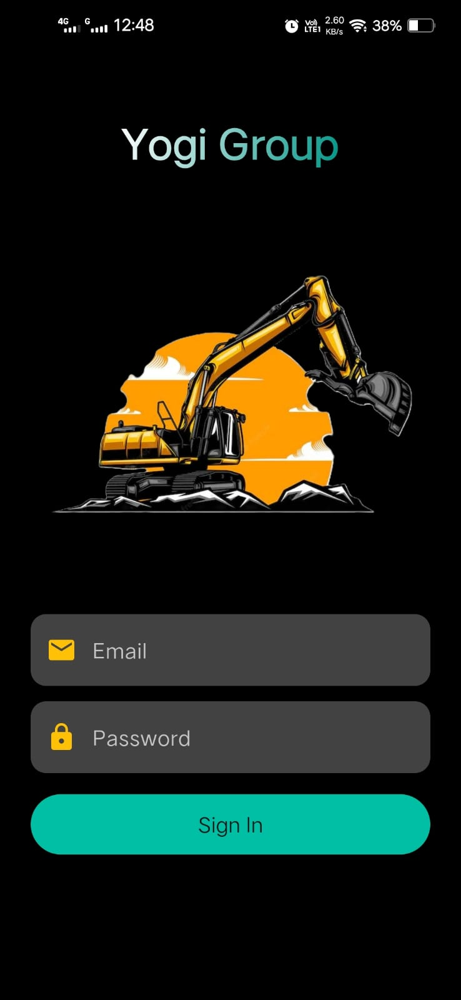
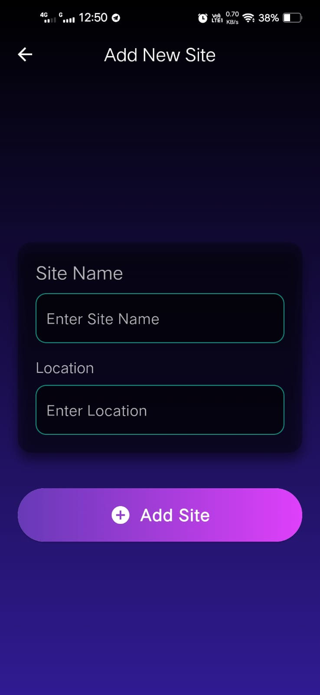

# Yogi-Group
# 🚜 Yogi Group Machinery Tracker

**Yogi Group Machinery Tracker** is a mobile application built for **Yogi Group** to digitize and streamline machinery operation tracking. The app replaces traditional paper-based methods with a secure, real-time, cloud-connected system using **Flutter** and **Firebase**. It enables operators and admins to manage machinery usage, diesel logs, and site data efficiently — anytime, anywhere.

---

## ✨ Features

### 🔐 Authentication & Access Control
- Firebase Authentication integration
- Role-based redirection:
  - ✅ **Admin** can register new users and access the admin dashboard
  - 👷 **Operators** can only log in and submit operation/diesel data
- Persistent login support

### 🏗️ Machine Entry
- Log detailed machine operation entries
- Fields include:
  - Machine Type (e.g., Bucket, Breaker)
  - Machine No.
  - Site Name
  - Start & Stop Timestamps
  - Machine Meter Photos (before & after)
  - Optional Diesel Entry during operation

### ⛽ Diesel Entry
- Operators can submit diesel refill entries separately
- Tracks:
  - Machine ID
  - Amount of Diesel
  - Site
  - Refill Timestamp

### 🗂️ Admin Dashboard
- View and manage:
  - Registered users
  - All machine entries
  - Diesel logs
  - Site and machine configurations
- Role-based data visibility and filtering

### 🌐 Real-Time Cloud Sync
- All data stored securely on **Firebase Firestore**
- Media (meter photos) stored in **Firebase Storage**
- Instant updates for operators and admins

### 🌍 Multilingual Support (Planned)
- Support for regional languages (e.g., Marathi, Hindi)

### 🧾 Reporting & Exports (Upcoming)
- Admin export options for PDF/Excel reports
- Data filters by date, machine, site, and operator

---

## 📁 Database Structure (Firebase Firestore)

```text
users (collection)
  └── {userId} → fullname, email

machinery_entries (collection)
  └── {entryId} → userId, machineType, machineID, startHour, stopHour, siteName, dieselEntry, driverID, imageUrl, createdAt

diesel_entries (collection)
  └── {entryId} → userId, machineID, amount, refillTime, siteName

sites (collection)
  └── {siteId} → siteName, location, createdAt

machine_types (collection)
  └── {typeId}
       └── machines (subcollection)
           └── {machineId} → isActive, createdAt

settings (collection)
  └── languageOptions, lastUpdated
```
## 🛠 Tech Stack

| Category       | Technology                                    |
| -------------- | --------------------------------------------- |
| Mobile App     | Flutter (Dart)                                |
| Backend        | Firebase Auth, Firestore, Firebase Storage    |
| Hosting        | Firebase                                      |
| Optional Tools | Firebase Cloud Functions, PDFKit, GetX/Provider |

---

## 📸 Screenshots

## 📸 Screenshots

<table>
  <tr>
    <td align="center">
      <strong>Login Page</strong><br>
      
    </td>
    <td align="center">
      <strong>Worker Dashboard</strong><br>
      
    </td>
    <td align="center">
      <strong>Worker Profile</strong><br>
      
    </td>
  </tr>
  <tr>
    <td align="center">
      <strong>Machine Entry</strong><br>
      
    </td>
    <td align="center">
      <strong>Diesel Entry</strong><br>
      
    </td>
    <td align="center">
      <strong>Generate Report</strong><br>
      
    </td>
  </tr>
  <tr>
    <td align="center">
      <strong>Maintenance</strong><br>
      
    </td>
    <td align="center">
      <strong>Add User</strong><br>
      
    </td>
    <td align="center">
      <strong>Add New Site</strong><br>
      
    </td>
  </tr>
  <tr>
    <td align="center">
      <strong>Admin Dashboard</strong><br>
      
    </td>
    <td align="center">
      <strong>User Management</strong><br>
      
    </td>
    <td></td>
  </tr>
</table>


## 👨‍💻 Developed By
Gaurav Kathe and Vaibhav Bhagwat
---


